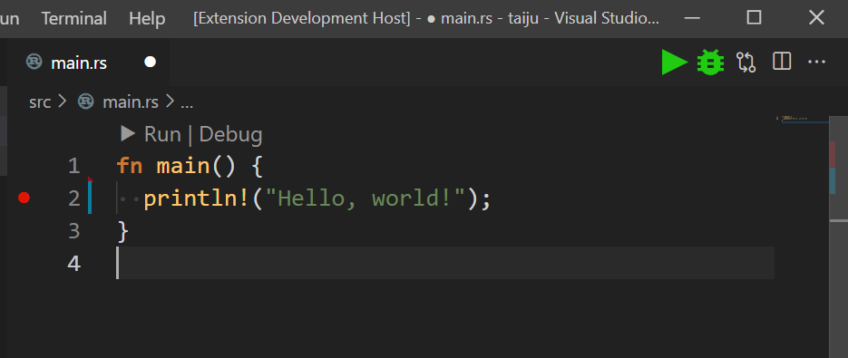

# "Launch buttons" in vscode.

Add "Run" and "Debug" button to execute commands in launch.json in your vscode.

## Copyright

These icons are based on [Material Icons](https://fonts.google.com/icons) by Google. Licensed under [Apache License 2.0](https://www.apache.org/licenses/LICENSE-2.0.html):

 - images/run.light.svg
 - images/run.dark.svg

These icons are drawn by myself:

 - images/run.light.svg
 - images/run.dark.svg

## Release Notes

### 1.0.0

Initial release.
